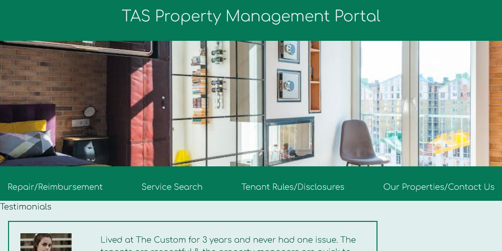

# Property Management Portal Demo

Welcome to TAS Property Management Portal. Here we offer a resource page to current and prior tenants. This resource page is up to date with Los Angeles County Housing Department's documents for all tenants in the city of Los Angeles. If you require assistance in defining if your rental unit is subject to ordinance for the City of Los Angeles, we encourage you to get in touch with LACHD at (866)-557-7368. 

Upon accessing our website, you will be briefed with a home page that features testimonials and Upcoming Community Events at our properties. We offer a Repair/Reinbursement page for current tenants to create a request for reinbursement, repairs, complaints, or anything you may need to communicate to the property management company. Our Service Search Page allows users to search Google for relevant services near your building. Following is a resource page that offers a list of documents available for use for renters in the Los Angeles County. Documents can be downloaded as PDF files. Our Properties are listed on the Contact Us page with an emergancy contact number for each building. If you require immidate assistance we reccomend filling out a Repair/Reinbursement form to state the emergency. 

## Functionality

The front page of the website that features testimonials from (fictitious) residents and upcoming events at the company's properties (also fictitious).  Across the middle-top of the page is a navigation bar with the following options:

* **Repair/Reimbursement:** A page containing a form by which tenants can request repairs, file complaints, and so on.
* **Service Search:** A page allowing tenants to search for nearby service providers, such as plumbers.  This page uses jQuery to process a form and feed the selections into the Google Custom Search API.  Search results are then displayed on the page.
* **Tenant Rules/Disclosures:** Contains links to PDF forms that can be downloaded by the end user.
* **Our Properties/Contact Us:** A list of the properties and contact information.

## Mock-Up

The home page looks like this:

## Technologies Used

* The CSS on the site is a mixture of custom-written CSS and [Tailwind CSS](https://tailwindcss.com/docs/installation/play-cdn).
* The site uses [jQuery](https://jquery.com/) to dynamically update certain pages.
* The Service Search page uses the [Google Custom Search JSON API](https://developers.google.com/custom-search/v1/overview).
* The Repair/Reimbursement page uses the [MailChimp API](https://mailchimp.com/).

## Deployed Application

You can find a live version of the site [here](https://giancarlow333.github.io/property-mgmt-portal/).

## Sources

* The various photographs found on the site are via [pexels.com](https://www.pexels.com/) and are free to use without attribution.
* The code for including HTML from a separte file via jQuery came from [this StackOverflow thread](https://stackoverflow.com/questions/15320801/how-to-include-an-html-file-with-jquery), via a user named [Boaz](https://stackoverflow.com/users/1889273/boaz).
* The code for selecting an option from a dropdown with jQuery the is from [this StackOverflow thread](https://stackoverflow.com/questions/10659097/jquery-get-selected-option-from-dropdown).  This is used in the [script2.js](./assets/script2.js) file, which enables the Google Custom Search API on [service_search.html](./service_search.html).
* The displayResults() function in the above code is primarily copied from [the Google Custom Search API documentation](https://developers.google.com/custom-search/v1/using_rest), with minor modifications.

---

Written by Hemdah Colicchio, Brandon Lopez, Jenny Wannier, and Giancarlo Whitaker, 2023
